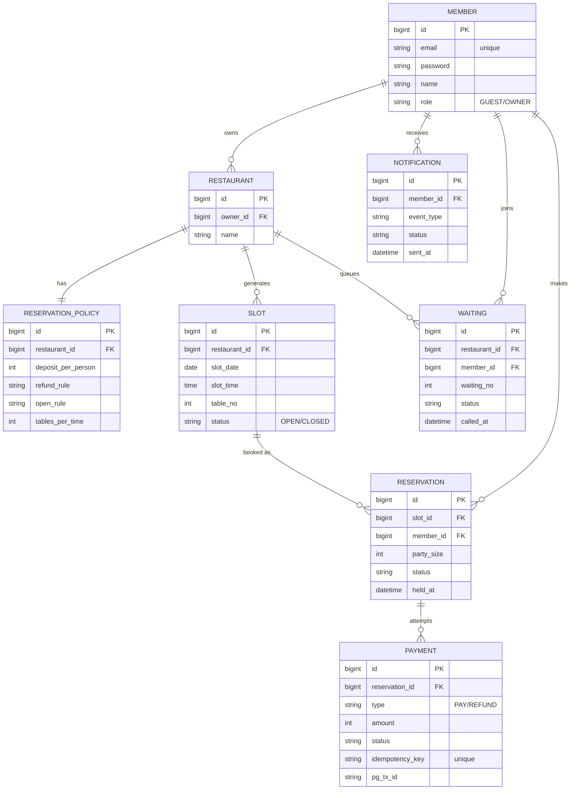

# tably ERD v1 (2026-07-21 확정)

## 설계 3원칙

1. 예약(reservation)과 결제(payment)는 분리 — 결제 시도 1번 = payment 1행, 사건은 쌓는다
2. 슬롯은 오픈 시점에 사전 생성 — 락 대상 확보, 빈자리 조회 단순화, 상태 관리
3. 상태의 주인은 reservation.status — slot.status는 OPEN/CLOSED만 (중복 저장 금지)

정산(settlement), 이의신청(appeal) 테이블은 해당 기능 착수 시 추가.
